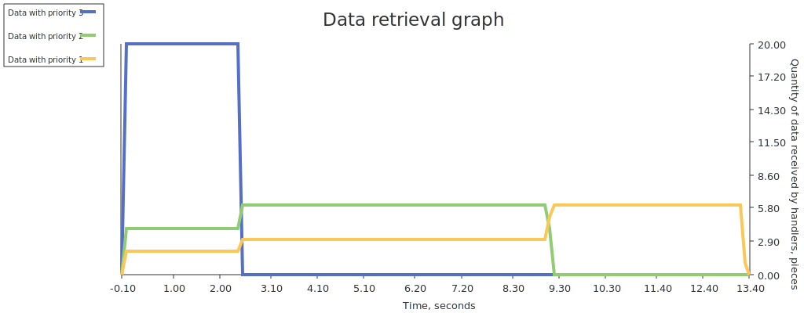
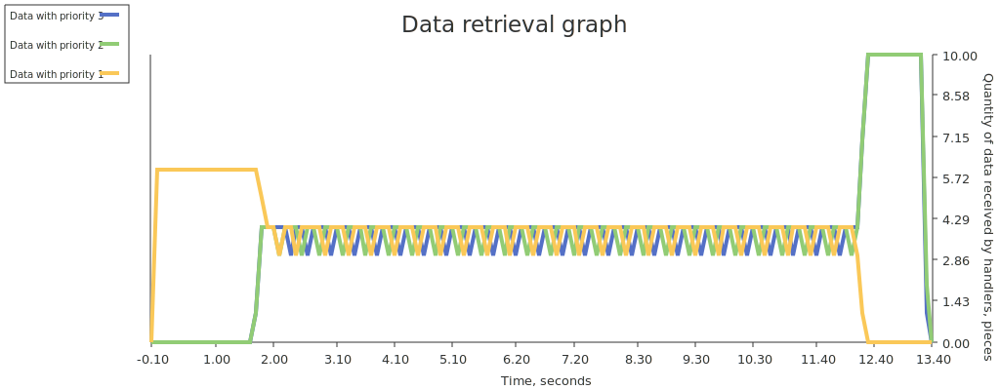

# Priority discipline

## Purpose

Used to distributes data among handlers according to priority

Also may be used to equaling distribution of data with different processing times

## Principle of operation

* Prioritization:

  

* Equaling:

  

## Comparison with unmanaged distribution

If different times are spent processing data of different priorities, then we will get different processing speeds in the case of using the priority discipline and without it.

For example, suppose that data from channel of priority 3 is processed in time **T**, data from channel of priority 2 is processed in time 5\***T**, and data from channel of priority 1 is processed in time 10\***T**, then we will get the following results (number of processed data and the number of handlers are the same in both cases):

* equaling by priority discipline:

  

* unmanaged distribution:

  

It can be seen that with unmanaged distribution, the processing speed of data with priority 3 is limited by the slowest processed data (with priority 1 and 2), but at with equaling by priority discipline the processing speed of data with priority 3 is no limited by others priorities. Similarly, with unmanaged distribution, the processing speed of data with priority 2 is limited by slower processed data with priority 1, but there is no such limitation with equaling by priority discipline

## Usage

Example:

```go
package main

import (
    "fmt"
    "sync"

    "github.com/akramarenkov/cqos/priority"
)

func main() {
    handlersQuantity := uint(100)
    itemsQuantity := 10000
    // Preferably, input channels should be buffered for performance reasons
    inputCapacity := 10

    inputs := map[uint]chan int{
        70: make(chan int, inputCapacity),
        20: make(chan int, inputCapacity),
        10: make(chan int, inputCapacity),
    }

    // Map key is a value of priority
    inputsOpts := make(map[uint]<-chan int, len(inputs))

    for priority, channel := range inputs {
        inputsOpts[priority] = channel
    }

    // Data from input channels passed to handlers by output channel
    output := make(chan priority.Prioritized[int])

    // Handlers must write priority of processed data to feedback channel after it
    // has been processed
    feedback := make(chan uint)
    defer close(feedback)

    // Used only in this example for measuring input data
    measurements := make(chan int)

    // For equaling use FairDivider, for prioritization use
    // RateDivider or custom divider
    opts := priority.Opts[int]{
        Divider:          priority.RateDivider,
        Feedback:         feedback,
        HandlersQuantity: handlersQuantity,
        Inputs:           inputsOpts,
        Output:           output,
    }

    discipline, err := priority.New(opts)
    if err != nil {
        panic(err)
    }

    wg := &sync.WaitGroup{}
    defer wg.Wait()

    // Running writers, that write data to input channels
    for _, input := range inputs {
        wg.Add(1)

        go func(channel chan int) {
            defer wg.Done()
            defer close(channel)

            for id := range itemsQuantity {
                channel <- id
            }
        }(input)
    }

    // Running handlers, that process data
    for range handlersQuantity {
        wg.Add(1)

        go func() {
            defer wg.Done()

            for prioritized := range output {
                // Data processing
                measurements <- prioritized.Item

                // Handler must indicate that current data has been processed and
                // handler is ready to receive new data
                feedback <- prioritized.Priority
            }
        }()
    }

    // Terminate handlers
    defer close(output)

    // For simplicity, the process of graceful termination of the discipline is
    // starts immediately
    go discipline.GracefulStop()

    // Waiting for the completion of the discipline
    go func() {
        defer close(measurements)

        for err := range discipline.Err() {
            if err != nil {
                fmt.Println("An error was received: ", err)
            }
        }
    }()

    received := 0

    // Receiving the measurements data
    for range measurements {
        received++
    }

    fmt.Println("Processed data items quantity:", received)
    // Output: Processed data items quantity: 30000
}
```

Example with graph:

```go
package main

import (
    "fmt"
    "os"
    "slices"
    "sort"
    "strconv"
    "sync"
    "time"

    "github.com/akramarenkov/cqos/priority"

    "github.com/guptarohit/asciigraph"
)

func main() {
    handlersQuantity := uint(100)
    itemsQuantity := 10000
    // Preferably, input channels should be buffered for performance reasons
    inputCapacity := 10

    processingTime := 10 * time.Millisecond
    graphInterval := 100 * time.Millisecond
    graphRange := 5 * time.Second

    inputs := map[uint]chan int{
        70: make(chan int, inputCapacity),
        20: make(chan int, inputCapacity),
        10: make(chan int, inputCapacity),
    }

    // Map key is a value of priority
    inputsOpts := make(map[uint]<-chan int, len(inputs))

    for priority, channel := range inputs {
        inputsOpts[priority] = channel
    }

    // Data from input channels passed to handlers by output channel
    output := make(chan priority.Prioritized[int])

    // Handlers must write priority of processed data to feedback channel after it
    // has been processed
    feedback := make(chan uint)
    defer close(feedback)

    // Used only in this example for measuring input data
    type measure struct {
        priority     uint
        relativeTime time.Duration
    }

    // Channel size is equal to the total amount of input data in order to minimize
    // delays in collecting measurements
    measurements := make(chan measure, itemsQuantity*len(inputs))

    // For equaling use FairDivider, for prioritization use
    // RateDivider or custom divider
    opts := priority.Opts[int]{
        Divider:          priority.RateDivider,
        Feedback:         feedback,
        HandlersQuantity: handlersQuantity,
        Inputs:           inputsOpts,
        Output:           output,
    }

    discipline, err := priority.New(opts)
    if err != nil {
        panic(err)
    }

    wg := &sync.WaitGroup{}
    defer wg.Wait()

    // Running writers, that write data to input channels
    for _, input := range inputs {
        wg.Add(1)

        go func(channel chan int) {
            defer wg.Done()
            defer close(channel)

            for id := range itemsQuantity {
                channel <- id
            }
        }(input)
    }

    startedAt := time.Now()

    // Running handlers, that process data
    for range handlersQuantity {
        wg.Add(1)

        go func() {
            defer wg.Done()

            for prioritized := range output {
                // Data processing
                item := measure{
                    priority:     prioritized.Priority,
                    relativeTime: time.Since(startedAt),
                }

                time.Sleep(processingTime)

                measurements <- item

                // Handler must indicate that current data has been processed and
                // handler is ready to receive new data
                feedback <- prioritized.Priority
            }
        }()
    }

    // Terminate handlers
    defer close(output)

    // For simplicity, the process of graceful termination of the discipline is
    // starts immediately
    go func() {
        discipline.GracefulStop()
    }()

    // Waiting for the completion of the discipline
    go func() {
        defer close(measurements)

        for err := range discipline.Err() {
            if err != nil {
                fmt.Println("An error was received: ", err)
            }
        }
    }()

    received := make(map[uint][]measure, len(inputs))

    // Receiving the measurements data
    for item := range measurements {
        received[item.priority] = append(received[item.priority], item)
    }

    // Sort measurements data by relative time for further research
    for _, measures := range received {
        less := func(i int, j int) bool {
            return measures[i].relativeTime < measures[j].relativeTime
        }

        sort.SliceStable(measures, less)
    }

    // Calculating quantity of input data received by handlers over time
    quantities := make(map[uint][]float64)

    for span := time.Duration(0); span <= graphRange; span += graphInterval {
        for priority, measures := range received {
            quantity := float64(0)

            for _, measure := range measures {
                if measure.relativeTime < span-graphInterval {
                    continue
                }

                if measure.relativeTime >= span {
                    break
                }

                quantity++
            }

            quantities[priority] = append(quantities[priority], quantity)
        }
    }

    // Preparing research data for plot
    serieses := make([][]float64, 0, len(quantities))
    priorities := make([]uint, 0, len(quantities))
    legends := make([]string, 0, len(quantities))

    for priority := range quantities {
        priorities = append(priorities, priority)
    }

    // To keep the legends in the same order
    slices.Sort(priorities)
    slices.Reverse(priorities)

    for _, priority := range priorities {
        serieses = append(serieses, quantities[priority])
        legends = append(legends, strconv.Itoa(int(priority)))
    }

    graph := asciigraph.PlotMany(
        serieses,
        asciigraph.Height(10),
        asciigraph.Caption("Quantity of data received by handlers over time"),
        asciigraph.SeriesColors(asciigraph.Red, asciigraph.Green, asciigraph.Blue),
        asciigraph.SeriesLegends(legends...),
    )

    fmt.Fprintln(os.Stderr, graph)

    fmt.Println("See graph")
    // Output:
    // See graph
}
```
