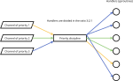

# Priority discipline

## Purpose

Used to distributes data among handlers according to priority

Also may be used to equaling distribution of data with different processing times

## Principle of operation

* Prioritization:

  

* Equaling:

  

## Comparison with unmanaged distribution

If different times are spent processing data of different priorities, then we will get different processing speeds in the case of using the priority discipline and without it.

For example, suppose that data from channel of priority 3 is processed in time **T**, data from channel of priority 2 is processed in time 5\***T**, and data from channel of priority 1 is processed in time 10\***T**, then we will get the following results:

* equaling by priority discipline:

  

* unmanaged distribution:

  

It can be seen that with unmanaged distribution, the processing speed of data with priority 3 is limited by the slowest processed data (with priority 1 and 2), but at with equaling by priority discipline the processing speed of data with priority 3 is no limited by others priorities

## Usage

Example:

```go
package main

import (
    "fmt"
    "strconv"
    "sync"

    "github.com/akramarenkov/cqos/priority"
    "github.com/akramarenkov/cqos/priority/divider"
    "github.com/akramarenkov/cqos/types"
)

func main() {
    handlersQuantity := 100
    // Preferably input channels should be buffered
    inputCapacity := 10
    itemsQuantity := 100

    inputs := map[uint]chan string{
        3: make(chan string, inputCapacity),
        2: make(chan string, inputCapacity),
        1: make(chan string, inputCapacity),
    }

    // Map key is a value of priority
    inputsOpts := map[uint]<-chan string{
        3: inputs[3],
        2: inputs[2],
        1: inputs[1],
    }

    defer func() {
        for _, input := range inputs {
            close(input)
        }
    }()

    // Data from input channels passed to handlers by output channel
    output := make(chan types.Prioritized[string])

    // Handlers must write priority of processed data to feedback channel after it has been processed
    feedback := make(chan uint)
    defer close(feedback)

    // Used only in this example for detect that all written data are processed
    measurements := make(chan bool)
    defer close(measurements)

    // For equaling use divider.Fair divider, for prioritization use divider.Rate divider or custom divider
    disciplineOpts := priority.Opts[string]{
        Divider:          divider.Rate,
        Feedback:         feedback,
        HandlersQuantity: uint(handlersQuantity),
        Inputs:           inputsOpts,
        Output:           output,
    }

    discipline, err := priority.New(disciplineOpts)
    if err != nil {
        panic(err)
    }

    defer discipline.Stop()

    wg := &sync.WaitGroup{}
    defer wg.Wait()

    // Run handlers, that process data
    for handler := 0; handler < handlersQuantity; handler++ {
        wg.Add(1)

        go func() {
            defer wg.Done()

            for prioritized := range output {
                // Data processing
                fmt.Println(prioritized.Item)
                measurements <- true

                feedback <- prioritized.Priority
            }
        }()
    }

    // Run writers, that write data to input channels
    for priority, input := range inputs {
        wg.Add(1)

        go func(precedency uint, channel chan string) {
            defer wg.Done()

            base := strconv.Itoa(int(precedency))

            for id := 0; id < itemsQuantity; id++ {
                item := base + ":" + strconv.Itoa(id)
                
                channel <- item
            }
        }(priority, input)
    }

    defer close(output)

    received := 0

    // Wait for process all written data
    for range measurements {
        received++

        if received == itemsQuantity*len(inputs) {
            return
        }
    }
}
```
