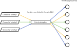

# Priority discipline

## Purpose

Used to distributes data among handlers according to priority

Also may be used to equaling distribution of data with different processing times

## Principle of operation

Prioritization:

Equaling:

## Comparison with unmanaged distribution

If different times are spent processing data of different priorities, then we will get different processing speeds in the case of using the priority discipline and without it:

Equaling by priority discipline:

Unmanaged distribution:

